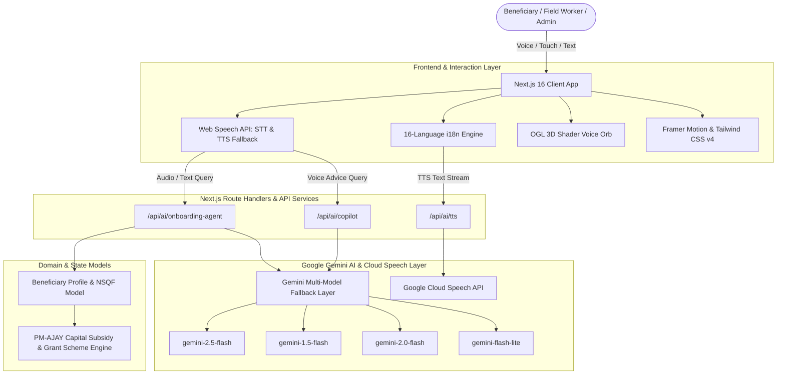

# Sakhyam-AI (Sakhyam-AI) — Complete Tech Stack & Feature Architecture

> **Sakhyam-AI** is an AI-powered vernacular livelihood intelligence, NSQF skill-alignment, and PM-AJAY enterprise enablement platform designed for rural beneficiaries, grassroots field workers, and state/central government administrators.

---

## 📑 Quick Navigation
1. [Core Platform & Runtime](#1-core-platform--runtime)
2. [Generative AI & LLM Architecture](#2-generative-ai--llm-architecture)
3. [Voice, Speech & Audio Processing](#3-voice-speech--audio-processing)
4. [3D Graphics, Shaders & WebGL](#4-3d-graphics-shaders--webgl)
5. [Frontend Design, UI & Animation System](#5-frontend-design-ui--animation-system)
6. [Multilingual Localization Engine (16 Indic Languages)](#6-multilingual-localization-engine-16-indic-languages)
7. [Feature-to-Tech Mapping Matrix](#7-feature-to-tech-mapping-matrix)
8. [System Architecture Diagram](#8-system-architecture-diagram)

---

## 1. Core Platform & Runtime

| Technology / Library | Version | Category | Feature & Purpose |
| :--- | :--- | :--- | :--- |
| **Next.js** | `16.3.6` | Web Framework | App Router architecture, Server & Client Components, Route Handlers (`/api/ai/*`), fast server-side streaming, and standalone deployment optimization. |
| **React** | `19.2.8` | UI Library | Component-driven UI, state management, hooks (`useRef`, `useCallback`, `useMemo`, `useState`, `useEffect`), and concurrent UI rendering. |
| **React DOM** | `19.2.8` | DOM Renderer | DOM tree reconciliation and portal rendering for interactive modal dialogs and bottom sheets. |
| **TypeScript** | `^5.0.0` | Type System | End-to-end static type safety across data contracts, AI agent responses, beneficiary profile structures, NSQF models, and component props. |
| **Bun** | `1.4.2` | Package Manager & Runtime | High-speed package resolution, scripts runner, hot module reloading (HMR), and dev server hosting. |

---

## 2. Generative AI & LLM Architecture

| Technology / Library | Version | Category | Feature & Purpose |
| :--- | :--- | :--- | :--- |
| **`@google/genai`** | `^2.24.0` | AI SDK | Next-generation official Google Gen AI SDK for structured multimodal generation and agentic tool integration. |
| **`@google/generative-ai`** | `^0.24.1` | AI SDK | Google Gemini API SDK used across backend server routes for multi-turn conversational agents, prompt execution, and text-to-speech coordination. |
| **Gemini Multi-Model Fallback Matrix** | `2.5-flash`, `1.5-flash`, `2.0-flash`, `flash-lite`, `1.5-flash-8b` | LLM Models | High-availability resilience layer in `lib/ai/gemini.ts` and `/api/ai/onboarding-agent`. Automatically cycles to the fastest available model to guarantee sub-second latency and zero downtime for rural users. |
| **Voice Onboarding AI Agent** | Custom Engine (`/api/ai/onboarding-agent`) | Conversational AI | Evaluates spoken inputs against 4 progressive profile milestones: Name & District extraction, NSQF skill categorization, educational qualification mapping, and PM-AJAY capital subsidy alignment. Cleans colloquial noise, prefixes, and conversational prepositions. |
| **Livelihood Copilot Agent** | Custom Route (`/api/ai/copilot`) | Decision Intelligence | Provides contextual advice on NSQF-certified vocational courses (Solar PV, Agri-Pump Repair, Food Processing, Tailoring), PM-AJAY ₹3,500/month stipends, and nearest certified skill center logistics. |
| **Dynamic Skill & NSQF Training Page Synthesis Engine** | Custom Engine (`lib/skillTrainingGenerator.ts`) | AI Program Synthesis | Automatically detects any new skill from worker profiles, voice onboarding, or PM-AJAY assessments (e.g. Solar Pump, Drone Spraying, EV Servicing, Mushroom Cultivation, Handloom, Micro-Enterprise) and dynamically synthesizes a complete NSQF Qualification Pack (QP/NOS code, NSQF Level 3-5, ₹3,500/mo DBT stipend, district training center, 4-module curriculum, and dedicated interactive training page). |
| **Multimodal Audio Transcriber** | Custom Route (`/api/ai/voice`) | Speech-to-Text | Fallback Gemini multimodal audio transcription parsing base64 WebM/WAV voice notes in rural Indic dialects. |

---

## 3. Voice, Speech & Audio Processing

| Technology / API | Source / Package | Category | Feature & Purpose |
| :--- | :--- | :--- | :--- |
| **Google Cloud Text-to-Speech API** | Backend Route (`/api/ai/tts`) | Neural Audio Synthesis | Synthesizes natural, human-like voice responses in Hindi, Odia, Santhali, Bengali, Marathi, Telugu, Tamil, and English with server-side caching (`Cache-Control: max-age=86400`). |
| **Web Speech Recognition API** | Browser Native (`webkitSpeechRecognition` / `SpeechRecognition`) | Client-side STT | Real-time live microphone stream transcription directly in the client browser with low latency and instant interim transcript feedback. |
| **Web SpeechSynthesis API** | Browser Native (`window.speechSynthesis`) | Client-side TTS Fallback | Instant zero-latency offline-compatible voice synthesis if network or server TTS is unavailable. |
| **Web Audio Context & Analyser** | Browser Native (`AudioContext`, `AnalyserNode`, `MediaStreamAudioSourceNode`) | Audio DSP & FFT | Captures microphone frequency amplitudes in real time to drive reactive visual audio bars and 3D shader pulsations. |

---

## 4. 3D Graphics, Shaders & WebGL

| Technology / Library | Version | Category | Feature & Purpose |
| :--- | :--- | :--- | :--- |
| **`ogl`** | `^1.0.11` | Minimal WebGL Library | High-performance, lightweight 3D WebGL renderer powering the animated voice orb (`VoicePoweredOrb.tsx`). |
| **Custom GLSL Shaders** | Vertex & Fragment Shaders | WebGL Graphics | Real-time GLSL mathematical shader programs generating organic procedural noise ripples, color shifting (RGB-to-YIQ color space), and voice-reactive volumetric glow without heavy GPU overhead. |

---

## 5. Frontend Design, UI & Animation System

| Technology / Library | Version | Category | Feature & Purpose |
| :--- | :--- | :--- | :--- |
| **Tailwind CSS v4** | `^4.0.0` | Styling Engine | Modern CSS theme tokens, glassmorphism (`backdrop-blur-md`), vibrant gradients (Emerald, Purple, Indigo, Amber), and responsive container utilities. |
| **`@tailwindcss/postcss`** | `^4.0.0` | CSS Processor | Lightning-fast PostCSS build pipeline for Tailwind CSS v4 styling. |
| **Framer Motion** | `^13.4.4` | Animation Library | Spring physics micro-animations, multi-step card transitions, pulsating voice badges, celebration screen entries, and modal layout morphs. |
| **Lucide React** | `^1.48.0` | Iconography | Crisp vector icons for UI actions (Microphone, Sparkles, Shield, Wrench, GraduationCap, Briefcase, Chevron, Volume, Edit, Check). |
| **`canvas-confetti`** | `^1.9.4` | Visual Effects | Physics-based celebratory confetti burst upon completing the 4-step verified Livelihood Passport. |
| **`@radix-ui/react-slot`** | `^1.3.3` | UI Primitives | Polymorphic component composition for headless button and badge wrappers. |
| **`class-variance-authority` (CVA)** | `^0.7.1` | Component Variants | Type-safe variant configurations for badges, buttons, and alert status indicators. |
| **`clsx` & `tailwind-merge`** | `^2.1.1` / `^3.7.0` | CSS Utilities | Conditional class merging and conflict resolution (`cn` utility in `lib/utils.ts`). |
| **`sharp`** | `^0.35.5` | Asset Optimization | Server-side image optimization, format conversions, and passport badge rendering. |

---

## 6. Multilingual Localization Engine (16 Indic Languages)

| Language Code | Language | Script | Supported Features |
| :--- | :--- | :--- | :--- |
| `hi` | **Hindi (हिन्दी)** | Devanagari | Full UI, Voice Onboarding, Gemini AI Prompts, Speech-to-Text, Google TTS, Passport Card. |
| `or` | **Odia (ଓଡ଼ିଆ)** | Odia | Full UI, Voice Copilot, District & Course translation, Gemini Prompts, TTS synthesis. |
| `sat` | **Santhali (ᱥᱟᱱᱛᱟᱲᱤ)** | Ol Chiki / Devanagari | Tribal community dialect support, Voice simulation, Skill translation, AI reasoning. |
| `bn` | **Bengali (বাংলা)** | Eastern Nagari | Full UI translation, Course names, Step descriptions, TTS audio. |
| `te` | **Telugu (తెలుగు)** | Telugu | Full UI localization, Voice feedback, Scheme recommendations. |
| `ta` | **Tamil (தமிழ்)** | Tamil | Full UI, Skill badge translation, Audio copilot support. |
| `mr` | **Marathi (मराठी)** | Devanagari | Full UI, Livelihood suggestions, Voice onboarding. |
| `gu` | **Gujarati (ગુજરાતી)** | Gujarati | Full UI, Micro-enterprise grant guidance. |
| `pa` | **Punjabi (ਪੰਜਾਬੀ)** | Gurmukhi | Full UI, Agri-skills and PM-AJAY funding prompts. |
| `kn` | **Kannada (ಕನ್ನಡ)** | Kannada | Full UI, Skill gap matching, Voice prompts. |
| `ml` | **Malayalam (മലയാളം)** | Malayalam | Full UI, Education and vocational pathway cards. |
| `as` | **Assamese (অসমীয়া)** | Bengali-Assamese | Full UI, Rural enterprise and livelihood advice. |
| `ur` | **Urdu (اردو)** | Nastaliq / Perso-Arabic | Full UI, Voice navigation and onboarding text. |
| `mai` | **Maithili (मैथिली)** | Devanagari | Full UI, Localised district and NSQF courses. |
| `bho` | **Bhojpuri (भोजपुरी)** | Devanagari | Full UI, Conversational voice prompt simulation. |
| `en` | **English** | Latin | Default international & administrative dashboard interface. |

---

## 7. Feature-to-Tech Mapping Matrix

```
┌────────────────────────────────────────────────────────────────────────────────────────┐
│                                 Sakhyam-AI PLATFORM                                    │
└────────────────────────────────────────────────────────────────────────────────────────┘
                                     │
      ┌──────────────────────────────┼──────────────────────────────┐
      │                              │                              │
      ▼                              ▼                              ▼
┌──────────────────┐           ┌──────────────────┐           ┌──────────────────┐
│ BENEFICIARY FLOW │           │ FIELD WORKER HUB │           │ GOVT DASHBOARD   │
└──────────────────┘           └──────────────────┘           └──────────────────┘
      │                              │                              │
      ├─► Voice Onboarding           ├─► Household Auditing         ├─► State Heatmaps
      │   (Web Speech + Gemini)      │   (Offline Sync + GPS)       │   (District Analytics)
      ├─► 3D Voice Orb               ├─► Latent Skill Extraction    ├─► PM-AJAY Grants
      │   (OGL + WebGL Shaders)      │   (AI Parser + NSQF QP)      │   (Fund Disbursement)
      ├─► Livelihood Passport        ├─► Mobile Bottom Sheets       ├─► Scheme Matching
      │   (Canvas Confetti + Framer) │   (Touch-friendly UI)        │   (KPI Visualizations)
      └─► Multi-dialect TTS          └─► Batch Synchronization      └─► Role-Based Auth
          (Google TTS + Web Speech)      (Local Storage + Next API)     (Secure Sessions)
```

### Detailed Feature Breakdown:

1. **4-Step Agentic Voice Onboarding (`PersonalVoiceOnboarding.tsx`)**:
   - **Technologies**: Next.js App Router, React 19 Hooks, `@google/generative-ai`, Web Speech API, Google TTS, Framer Motion, Lucide Icons, Canvas Confetti.
   - **Capabilities**:
     - Voice conversation in 16 languages.
     - Auto-slot filling for Name/Location, NSQF Courses (Solar PV, Agri-pump, Electrician, Tailoring), Education Level, and PM-AJAY capital subsidies.
     - Instant manual edit modal (`Edit3`) with two-way synchronization.
     - Inline text typing fallback for noisy environments.
     - Celebratory confetti and audio badge issuance.

2. **3D Audio-Reactive Voice Visualizer (`voice-powered-orb.tsx`)**:
   - **Technologies**: `ogl`, WebGL, GLSL Shaders, Web Audio API (`AudioContext`, `AnalyserNode`).
   - **Capabilities**: Deforms 3D sphere geometry and dynamically shifts RGB hues according to user mic decibel volume and voice frequency.

3. **Grassroots Field Worker Copilot (`FieldWorkerCopilot.tsx`)**:
   - **Technologies**: React 19, TypeScript, Lucide React, Framer Motion, LocalStorage.
   - **Capabilities**: Rapid household surveys, voice-guided profile creation, offline data capture, and NSQF QP Code classification.

4. **Executive Government & Scheme Dashboard (`GovernmentDashboard.tsx`, `WebDashboard.tsx`)**:
   - **Technologies**: Next.js Server Components, Tailwind CSS v4, Lucide React, Radix UI Slot.
   - **Capabilities**: Real-time beneficiary status tracking, district-level saturation indices, PM-AJAY micro-enterprise grant disbursements, and training center capacity utilization.

5. **Universal Voice Navigator & Intent Classifier (`GlobalVoiceNavigator.tsx`, `lib/ai/voiceNavigation.ts`)**:
   - **Technologies**: Web Speech Recognition, Phonetic Multilingual Intent Classifier, Client-Side TTS, React Portals.
   - **Capabilities**: Hands-free voice navigation across 25+ specific NSQF courses, jobs, schemes, profiles, and administrative dashboards in Hindi, Odia, Santhali, Bengali, Marathi, Telugu, and English with audio feedback.

6. **Section-Wise NSQF Skill & Livelihood Hub (`MobileTrainingPage.tsx`, `MobileTrainingDetailPage.tsx`, `WebDashboard.tsx`)**:
   - **Technologies**: React 19, Framer Motion, Tailwind CSS v4, Lucide React, Custom Synthesis Engine (`lib/skillTrainingGenerator.ts`).
   - **Capabilities**:
     - **6 Core Sectors**: Green Energy & Tech, Agriculture & Allied, Handicrafts & SHG, Healthcare & Community, Digital & Infrastructure, Agro-Mills & PM-AJAY Grants.
     - **25 Comprehensive NSQF Courses**: Solar PV Agri-Pump, Kisan Drone Pilot, EV 2W/3W Technician, Biogas Plant, Commercial Mushroom & Spawn, Dairy Processing, Apiculture Honey, Poultry Hatchery, Fisheries Biofloc, Shree Anna Millet Bakery, Cold-Press Oil Mill, Spice Pulverization, Auto & Tractor Mechanic, Solar CCTV & Wi-Fi, Modern Masonry & Fly-Ash Brick, Plumbing RO Plant, CSC Digital e-Gram, Telemedicine Clinic, Healthcare GDA, Ayush Herbal Distillation, Jacquard Handloom, Bamboo Craft, Fashion Boutique, Terracotta Pottery, and Electrician.
     - **Pervasive AI Access**: 1-Tap "Ask AI Copilot" prompts on every course card and detail view, instant vernacular TTS playback, dynamic syllabus accordions, wage vs. enterprise earnings, and PM-AJAY DBT stipend breakdown.

---

## 8. System Architecture Diagram



---

*Generated for Sakhyam-AI (Sakhyam-AI) | SIH Platform Architecture Document*
